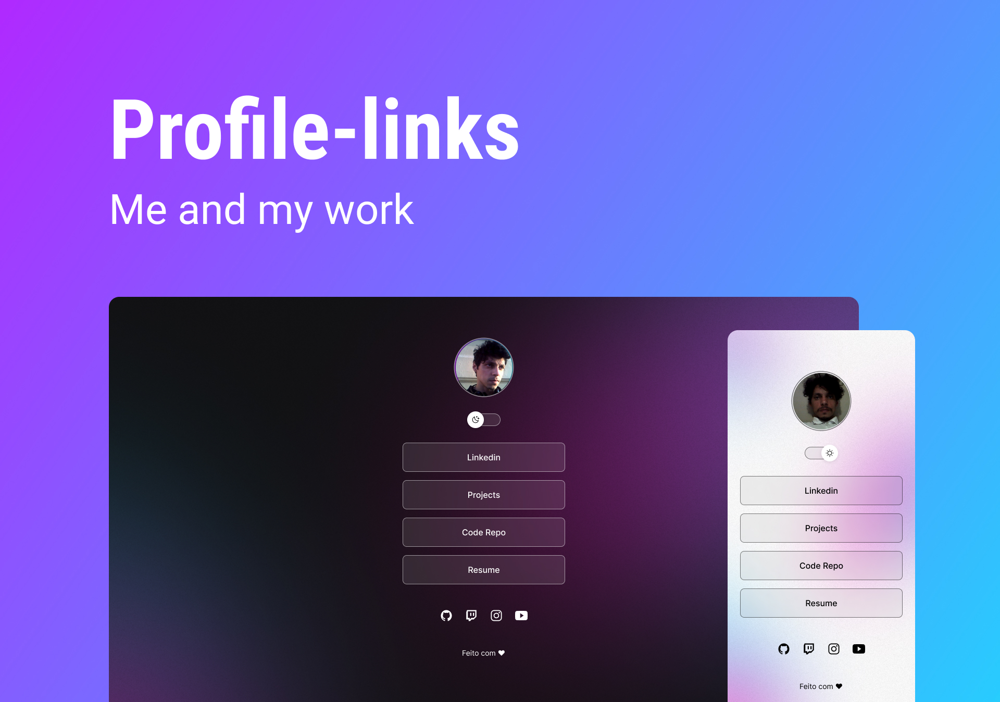

<h1 align="center"> Profile-links </h1>

Este projeto tem o objetivo de demonstrar tecnicas de desenvolvimento front-end.  

  <a href="#memo-tecnologias">Tecnologias</a>&nbsp;&nbsp;&nbsp;|&nbsp;&nbsp;&nbsp;
  <a href="#memo-projeto">Projeto</a>&nbsp;&nbsp;&nbsp;|&nbsp;&nbsp;&nbsp;
  <a href="#memo-licença">Licença</a>

  

 

  

## :memo: Tecnologias

Esse projeto foi desenvolvido com as seguintes tecnologias:

- HTML e CSS
- JavaScript
- Git e Github
- Figma

## :memo: Projeto

O profile-links é um agregador de links para usar como cartão de visitas online.

- [Acesse o projeto finalizado, online](https://charming-fairy-559f7e.netlify.app)

## :memo: Licença

Esse projeto está sob a licença MIT.

---

Feito com ♥ by Wazni :wave: 